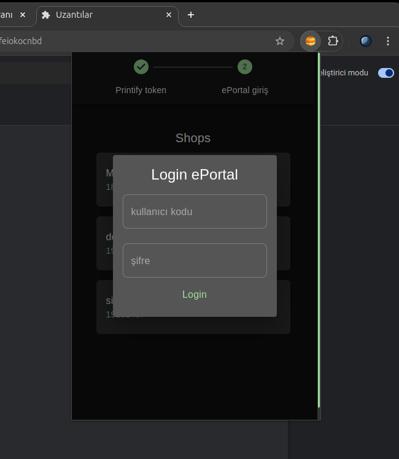
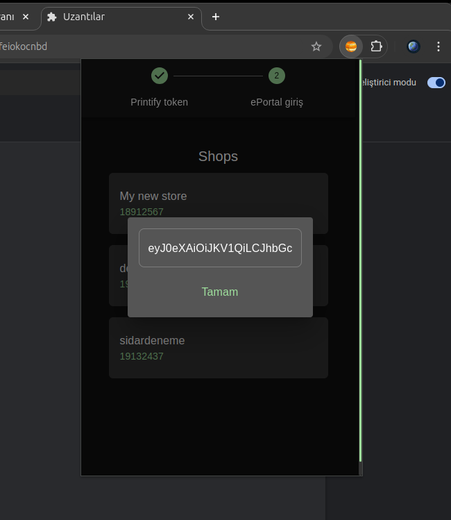
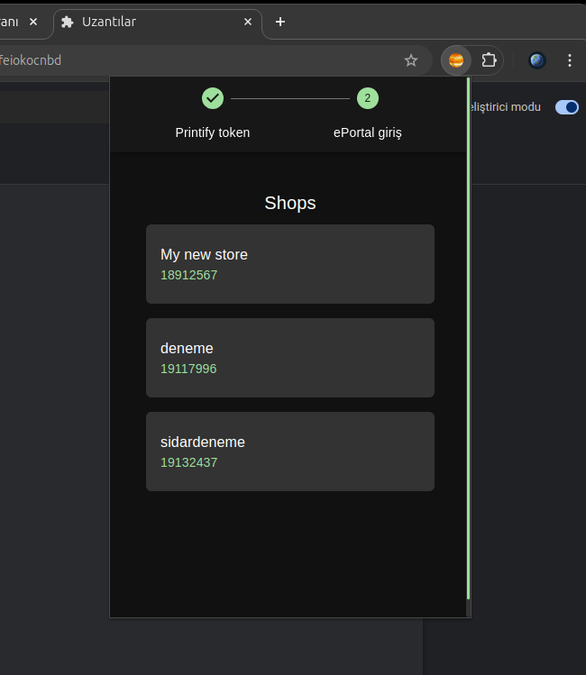
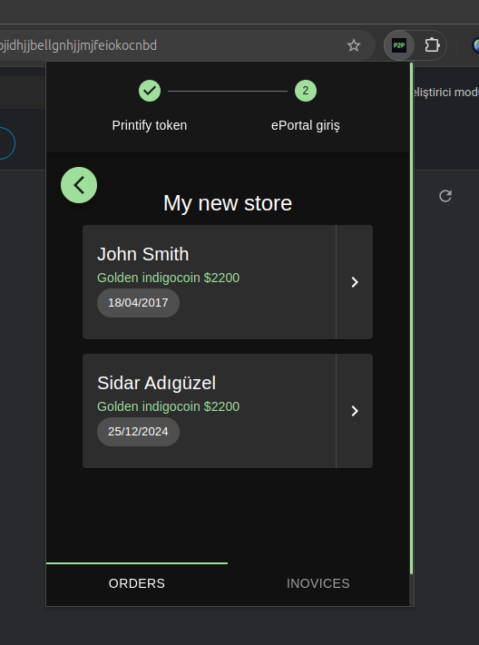

#  Printify to ePortal Extension

## Genel Bakış

P2p Extension, Printify'daki siparişlerinizi kolayca ePortal'da faturalandırmanızı sağlar.

## Özellikler

-   **Güvenli Kimlik Doğrulama**: Token kullanarak kimlik doğrulama.
-   **Mağazalar**: Hesabınıza bağlı mağazaları görüntüler.
-   **Siparişler**: Mağazalarınızdaki siparişleri alır.
-   **Faturalandırma**: Siparişlerinizi faturalandırarar ePortal'a gönderir.


## Kurulum

1. Depoyu klonlayın:

    ```bash
    git clone https://github.com/kullaniciadi/p2p-extension.git
    ```

2. Proje dizinine gidin:

    ```bash
    cd p2p-extension
    ```

3. Bağımlılıkları yükleyin:

    ```bash
    npm install
    ```

4. Projeyi derleyin:

    ```bash
    npm run build
    ```

5. Eklentiyi tarayıcınıza yükleyin:
    - Tarayıcınızı açın ve eklentiler sayfasına gidin (örneğin, Chrome için `chrome://extensions`).
    - "Geliştirici modu"nu etkinleştirin.
    - "Paketlenmemiş yükle"ye tıklayın ve projenin `build` dizinini seçin.

## Kullanım

1. **Kimlik Doğrulama**:

    - e Portal için giriş:

    

    - printify için token girdisi:
      

    - Bilgilerinizi girin ve özelliklere erişmek için kimlik doğrulaması yapın.

2. **Mağazalar**:

    - Hesabınıza bağlı mağazaların listesini görüntüleyin.
      

3. **Siparişler**:
    - Mağazalarınızdaki siparişleri alın.
      
    - Sipariş detaylarını görüntüleyin ve ePortalda fatura oluşturun.
